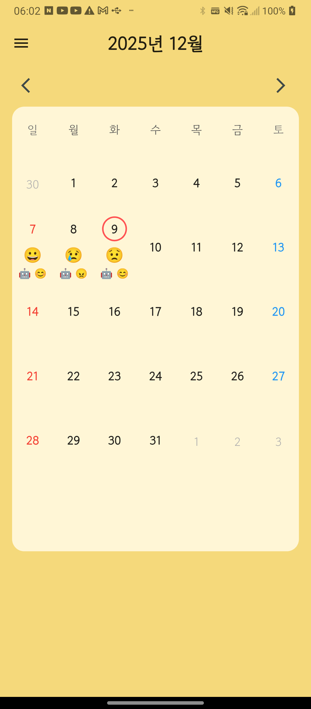
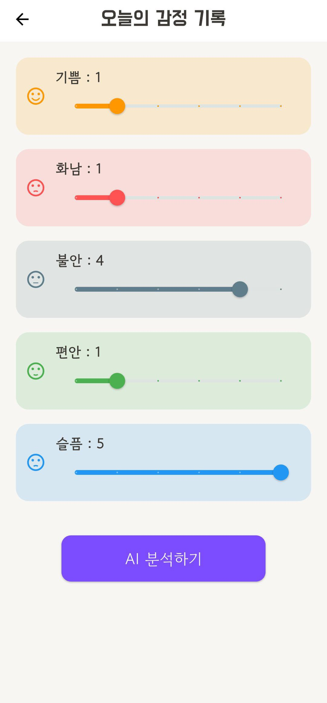
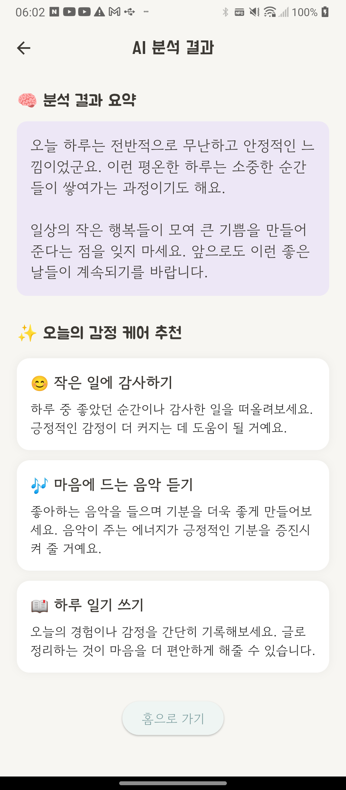
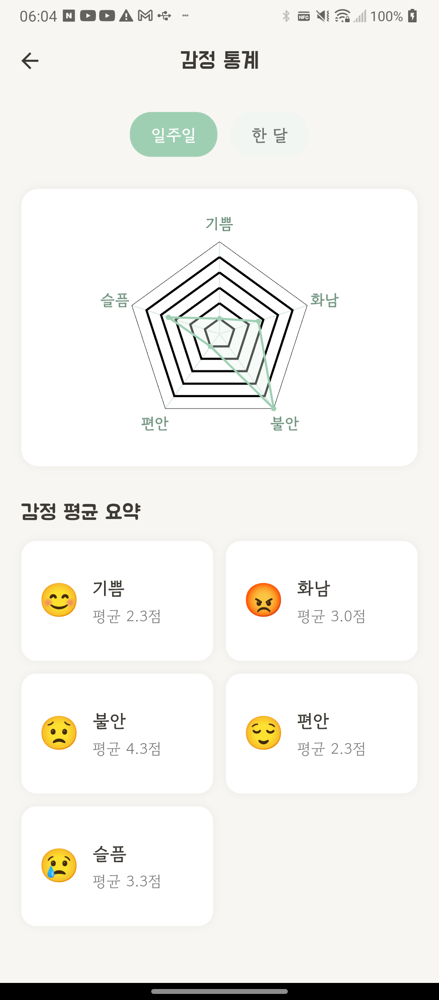
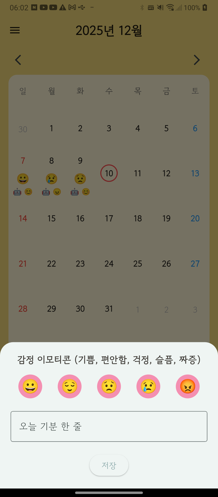

# 🧠 MindLog
> 캡스톤디자인 프로젝트 | 2025.10 ~ 2025.12

Flutter 기반 AI 감정 관리 애플리케이션입니다.
청소년 및 청년들이 일상에서 자신의 감정을 기록하고, AI 분석을 통해 감정 상태를 돌아볼 수 있도록 돕는 서비스입니다.

> 본 프로젝트에서 구현한 감정 기록 및 AI 분석 경험을 바탕으로, Spring Boot 백엔드와 연동하고 실제 출시를 목표로 하는 개인 프로젝트 마음이를 개발하고 있습니다.

## ✨ 주요 기능
- 🎚️ 감정 기록: 슬라이더를 이용한 기쁨, 화남, 불안, 평안, 슬픔의 5가지 감정 수치 입력
- 🤖 AI 감정 분석: OpenAI GPT API를 활용한 감정 분석 및 요약
- 💡 개인화 케어 추천: AI 분석 결과를 바탕으로 감정 케어 방법 제공
- 📅 감정 캘린더: 날짜별 사용자 선택 기분 이모지와 AI 분석 대표 이모지 표시, 한 줄 일기 확인 및 AI 분석 결과 조회
- 📊 감정 통계: 주간·월간 감정 평균 계산 및 레이더 차트 시각화

## 📱 주요 화면 및 구현
### 1. 메인 캘린더
<table>
  <tr>
    <td width="35%" align="left" valign="top">
            
    </td>
    <td width="65%" valign="top">
      
      주요 기능
      - 날짜별 사용자가 선택한 기분 대표 이모지 표시
      - AI가 분석한 해당 날짜의 기분 대표 이모지 표시
      - 날짜 선택 시 작성한 한줄 일기 확인
      - 날짜 길게 누를 시 AI 감정 분석 결과 화면으로 이동

      구현 내용
      - 날짜별 사용자 선택 이모지와 AI 선택 이모지 캘린더에 함께 표시
      - 선택한 날짜에 해당하는 한 줄 일기 확인 기능 구현
      - 날짜 길게 누르기 동작을 AI 분석 결과 화면과 연결

      관련 기술
      - Flutter, Dart
      - Firebase Authentication
      - Cloud Firestore

      핵심 구현
      - 캘린더 날짜와 사용자 기분 기록 및 AI 분석 결과 연결
      - 날짜 선택과 길게 누르기에 따른 서로 다른 화면 동작 구현
    </td>
  
  </tr>
</table>

### 2. 감정 기록
<table>
  <tr>
    <td width="35%" align="left" valign="top">
            
    </td>
    <td width="65%" valign="top">
      
      주요 기능
      - 기쁨, 화남, 불안, 평안, 슬픔의 5가지 감정 수치 입력

      구현 내용
      - 슬라이더를 통해 감정별 정도를 입력할 수 있도록 UI 구현
      - 입력한 감정 데이터를 기록 및 AI 분석 기능에 활용

      관련 기술
      - Flutter, Dart
      - Cloud Firestore

      핵심 구현
      - 감정 입력 UI와 기록 저장 흐름 연결
      </td>
  
  </tr>
</table>

### 3. AI 감정 분석
<table>
  <tr>
    <td width="35%" align="left" valign="top">
            
    </td>
    <td width="65%" valign="top">
      
      주요 기능
      - AI 기반 감정 분석 요약 제공
      - 감정 상태에 따른 케어 방법 추천

      구현 내용
      - OpenAI GPT API 연동
      - AI 분석 결과를 앱 화면에 표시

      관련 기술
      - Flutter, Dart
      - OpenAI GPT API

      핵심 구현
      - API 요청 및 응답 처리
      - 분석 결과를 사용자에게 전달하는 UI 구현
      </td>
  
  </tr>
</table>

### 4. 감정 통계
<table>
  <tr>
    <td width="35%" align="left" valign="top">
            
    </td>
    <td width="65%" valign="top">
      
      주요 기능
      - 주간·월간 감정 통계 확인
      - 감정별 평균을 레이더 차트로 시각화

      구현 내용
      - 기간별 감정 평균 계산 로직 구현
      - 계산 결과를 레이더 차트로 시각화

      관련 기술
      - Flutter, Dart
      - fl_chart

      핵심 구현
      - 감정 데이터 집계
      - 'RadarChart'를 활용한 통계 시각화
      </td>
  
  </tr>
</table>

### 5. 감정 이모티콘 선택
<table>
  <tr>
    <td width="35%" align="left" valign="top">
            
    </td>
    <td width="65%" valign="top">
      
      주요 기능
      - 캘린더에서 날짜 선택
      - 해당 날짜의 기분을 이모티콘으로 표현
      - 오늘의 기분을 한 줄 평으로 기록

      구현 내용
      - 캘린더에서 선택할 날짜를 기준으로 기분 기록 작성
      - 이모티콘과 한 줄 평을 입력하고 저장할 수 있는 UI 구현

      관련 기술
      - Flutter, Dart
      - Cloud Firestore

      핵심 구현
      - 선택한 날짜와 기분 기록을 연결하여 저장하고 조
      </td>
  
  </tr>
</table>

## 🛠 기술 스택
| 구분 | 기술 |
|------|------|
| Mobile | Flutter, Dart |
| Authentication | Firebase Authentication |
| Database | Cloud Firestore |
| AI Integration | OpenAI GPT API |
| Data Visulization | fl_chart |

## 👩‍💻 담당 역할 
### 4인 팀 프로젝트 | 팀장 / PM 및 핵심 기능 개발
- 프로젝트 관리: 프로젝트 전체 기획 및 일정 관리
- 데이터 관리: Firebase Authentication 연동 및 Cloud Firestore 데이터 구조 설계·구현
- AI 기능 개발: OpenAI API 연동 및 감정 분석 기능 구현
- UI 개발: 감정 입력, AI 분석 결과, 캘린더 및 통계 화면 구현
- 통계 기능 개발: 주간·월간 감정 평균 계산 로직 및 레이더 차트 시각화 구현

## 📅 프로젝트 기간
2025.10 ~ 2025.12 (약 3개월)

## 🔗 후속 프로젝트
- 📱 마음이(Maeum) Flutter 앱: https://github.com/Hello11234567/Maeum
- ⚙️ 마음이 서버: https://github.com/Hello11234567/maeum-server
